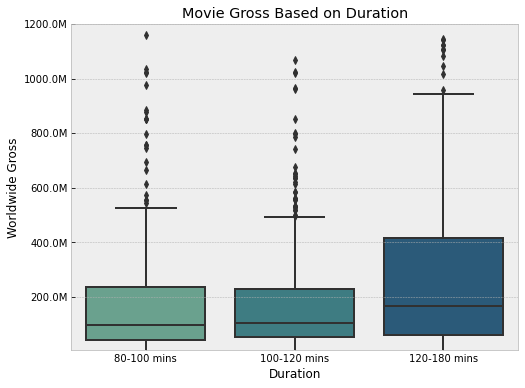
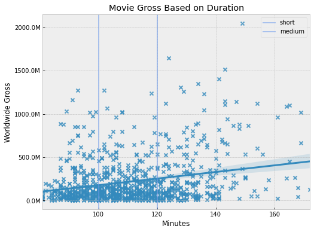
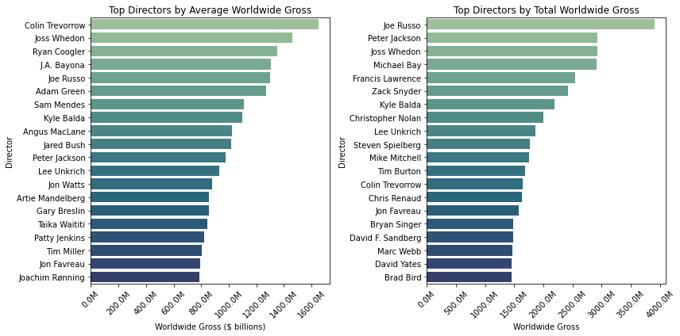
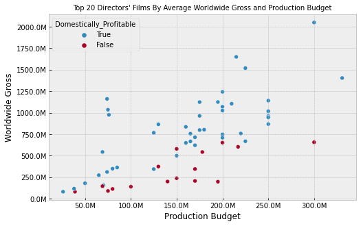
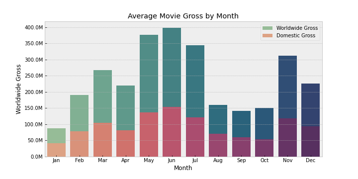
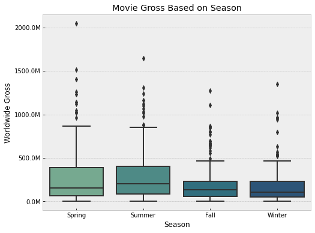
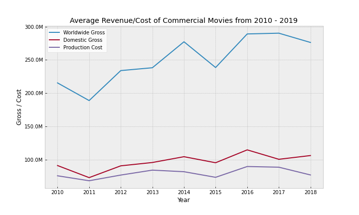
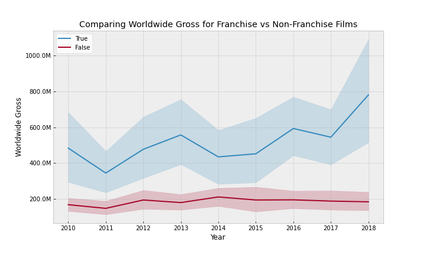
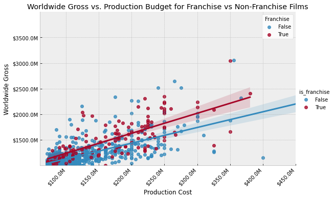

#  Movie Analysis

- Student name: Ethan Kunin
- Student pace: Full Time
- Scheduled project review date/time: March 23rd 4:00pm EST
- Instructor name: James Irving
- Blog post URL: https://github.com/kuninethan95/dsc-phase-1-project

# Business Problem

Microsoft sees all the big companies creating original video content and they want to get in on the fun. They have decided to create a new movie studio, but they don’t know anything about creating movies. You are charged with exploring what types of films are currently doing the best at the box office. You must then translate those findings into actionable insights that the head of Microsoft's new movie studio can use to help decide what type of films to create.

--------------------------

## Questions to address

- Which director should Microsoft select to direct their first feature film?
- Which month generates the highest revenue for films?
- Does film duration impact worldwide revenue? If so, is there a positive or negative relationship?
- Appendix A: Do franchise films earn more revenue than non-franchise films?

- Appendix B: How have movie revenue trends changed over the past 10 years

--------------------------------------------------------------

## Data
- Originated from IMBD and The Numbers
- Focused on commercial budget releases, classified as those with budgets exceeding [$20 million](https://www.marketwatch.com/storynetflix-reportedly-set-to-produce-90-movies-a-year-with-budgets-up-to-200-million-2018-12-16)
- Analyzing movies from 2010 onwards. Streaming gained more popularity and marketing strategies changed. 

- Analyzing movies exceeding [80 minutes](https://screenwriting.io/what-is-a-feature-film/). This is the technical minimum for theatrical releases

----------

## Analyzing how runtime impacts revenue
- We want to address if runtime has a positive correlation with worldwide gross revenue. 
- If movies are categorized by short, medium, and long, is there a statistical difference between revenue?

- Which of these duration categories has the greatest spread? 

### *Visualization A: Boxplot to illustrate how runtime impacts revenue*

                                                        
                                                       

    

### *Conclusion*
- Long movies have the highest median
- Long movies have the largest distributional spread
- Short and medium length movies have similar distributions

- **Recommendation:** Film should be at least 120 minuntes in runtime

### *Visualization B: Linear regression plot to illustrate how runtime impacts revenue*

### Conclusion 
- There is a positive relationship between film duration and worldwide gross
- Long movies have more outlier values. 

- 43% of films are considered 'medium' duration, 30% 'short' duration, and 27% 'long' duration
- **Recommendation:** Further support for long movies

# Analyze which directors generate the highest revenue
- Are the top directors consistently profitable?
- How much revenue do top directors' films earn?
- Are all films that top directors produce domestically and globally profitable?

- Choosing to hone in on revenue and cost because these measures have a greater influence on balance sheet than ROI. 

### *Visualization A: Top 20 Directors, 2 Graphs to display WW and Mean/Sum*

    

### *Conclusion*
- Many of the directors on the left chart also appear on the right
- Valuable list to parse through when considering who will direct the first film
- Outliers are a valuable data point because they can make a significant impact on balance sheet

- **Recommendation:** Joe Russo (Avengers) has generated over $3.9B in worldwide gross. Chose a director of similar total and average revenue

### *Visualization B: Analyze profitability and relationship between budget and worldwide revenue for Top Directors*

    

### *Conclusion* 
- Positive relationship between production budget & worldwide gross
- Not all movies are domestically profitable
- All movies are profitable when comparing production budget to worldwide gross

- Worldwide gross is a more impactful measurement than domestic. 
- **Recommendation:** Further support for selecting top grossing directors

# Analyze the best time to release a movie
- Evaluate which season  generates the highest amount of revenue on average. 
- Analyze which month generates the highest revenue per film on average

- This may be dependent on a number of factors such as awards seasons, consumer spending habits, quality of releases, and more. 

   

    

### *Visualization A: Stacked (domestic + worldwide) bar plot showing how much revenue films generate per month on average*

    

    

### *Conclusion*
- June movie generate the highest revenue on average followed by May and July
- Worldwide gross exceeds domestic gross in every month
- Total gross is lowest in January

- August-October is the lowest span of three consecutive months
- **Recommendation:** Release movies in Summer months

### *Visualization B: Boxplot of worldwide gross based on season*

    

### Conclusion 
- Spring and Summer films have the highest medians.
- Spring and Summer films have larger distributions.
- Corresponds with our month observations.
- While November is typically a high grossing month, December and January reduce the Winter average.
- **Recommendation:** Further support for releasing movies in Summer months

## Outcomes and Recommendations
- **Longer films outperform shorter films on average.** Consider releasing a film with a runtime that exceeds 120 minutes. There also tends to be more high outliers in this duration category.
-  **Top directors from 2010-2019 have produced profitable films from a worldwide gross perspective 100% of the time.** Consider hiring one of the top 20 directors suggested above. 
- **Summer films outperform any other season.** May through July produce the highest worldwide grossing films on average.
- **Long term consideration: produce a franchise.** Franchises earn more revenue than non-franchises. This may be partially due to organic marketing and loyal fanbases.  

## For more Informatoin ## 
---
 

See the full analysis in the Jupyter notebook or review the presentation in the GitHub repository

-----

### Appendix A: Analyze how movies have performed the past 10 years through trends
- Analyze how production costs have changed over the last 10 years.
- Analyze if worldwide gross and domestic gross have similar trends.

- Check if there are any years when costs exceeded either domestic or worldwide revenue.

### *Visualization A: Lineplot of worldwide/domestic gross/cost based on year*

 ### *Conclusion*
 - In 2017 worldwide revenue began to decline
 - In 2018 domestic revenue began to decline
 - Production costs have steadily risen but remain relatively flat
 - Worldwide revenue has exceeded production costs every year

 - Between 2018 and 2019 production costs exceeded domestic revenue

# Appendix B: Analyze how franchises perform compared to non-franchises
- Check if franchise films generate higher worldwide revenue on average than non-franchise films.
- Explore how this trend has varied over the past 10 years
- See which type of film has a greater positive correlation between production budget and revenue
- Used this [site](https://www.filmsite.org/) to gather data. 

### *Visualization A: Time trend for Franchise vs. Non-Franchise movies*

### *Conclusion:*
- Franchise films have outperformed non-franchise films every year
- They follow a similar trend, both declined towards 2018
- Franchise films have greater standard deviation
- **Recommendation:** Begin building a lasting franchise, possibly using licensed Microsoft IP (such as Halo)

### *Visualization B: Linear Regression Scatter Plot displaying relationship between Worldwide Gross and Production Cost for Franchise vs. Non-Franchise Films*

### *Conclusion:*
- Franchise films have a stronger positive relationship between revenue and cost than non-franchise films.
- The linear regression line is higher at every production cost value. 

### *Repository Structure:*
Extra. Scratch Notebook

Images. 

zippedData.

EKuninrepo.pdf

Ethan Kunin Movie Presentation.pdf

Movie_project_nb.pdf

Phase 1 Project Notebook.ipynb

README.md